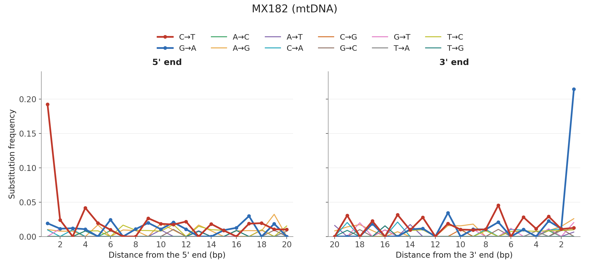
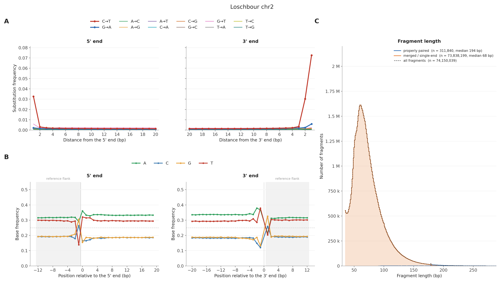
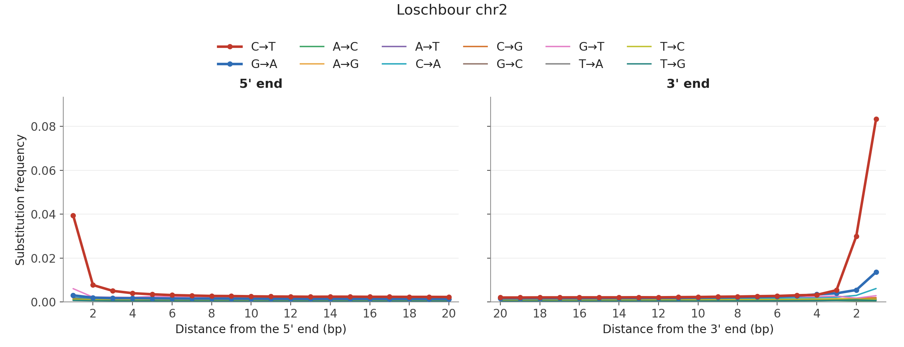
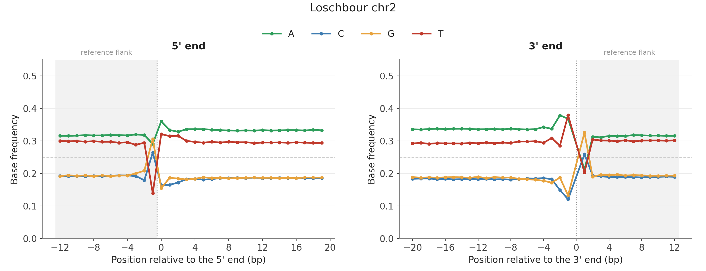
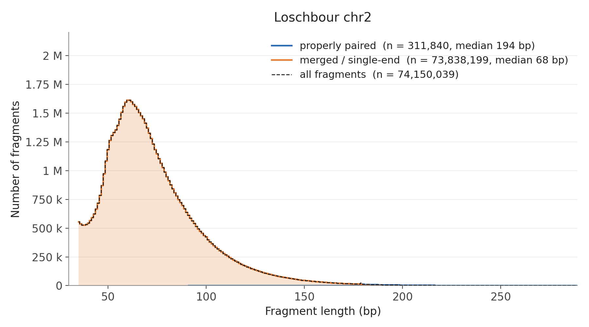

# bam2prof

bam2prof is a tool designed to analyze BAM files and generate substitution profiles, particularly useful for assessing ancient DNA damage patterns. This standalone version is derived from the subprogram in schmutzi (https://github.com/grenaud/schmutzi) but has been rewritten to utilize htslib (https://github.com/samtools/htslib).

## Features

- Substitution Profiling: Computes substitution rates at both 5' and 3' ends of reads to assess DNA damage patterns.
- Customizable Parameters: Allows users to set minimum base quality scores, minimum read lengths, and specify the length of the profile to generate.
 
 

## Requirements

- htslib: Ensure that htslib (https://github.com/samtools/htslib) is installed on your system, as bam2prof depends on it for BAM file processing.

## Installation

To build bam2prof, follow these steps:

1. Clone the Repository:

git clone https://github.com/grenaud/bam2prof.git

2. Navigate to the Source Directory:

cd bam2prof/src

3. Compile the Program:

make

This will generate the bam2prof executable in the src directory.

## Quick start

Build, then look at the damage patterns of the example in `testData/` (498 mtDNA reads, `MX182.b37_mtremap.bam`, with its reference `chrM.fa`).
By default bam2prof computes only the damage profiles; the base composition and fragment lengths are opt-in (below).

```bash
cd src && make && cd ..

# 1. the damage profile (substitution frequencies along the first 20 bp of each fragment end)
./src/bam2prof  -length 20 -o out/MX182 testData/MX182.b37_mtremap.bam

# 2. plot it
python3 src/plot_bam2prof.py out/MX182 --title "MX182 (mtDNA)"
#   -> out/MX182/bam2prof_summary.png and .pdf
```



The excess of C→T at the 5' end and of G→A at the 3' end (about 19% and 21% at the terminal base here) is the typical damage
pattern of ancient DNA. For your own data, replace the BAM (and, below, the reference) with yours.

**Optional: DNA composition around the breaks, and fragment lengths.** Both are computed only when you ask for them:

```bash
lib/samtools/samtools faidx testData/chrM.fa         # the reference needs an index (once)

# -comp: base composition at the fragment ends, with -fa also 12 bp of reference flanking each end
# -is:   fragment lengths (-paired also counts read pairs)
./src/bam2prof -classic -length 20 -comp -around 12 -fa testData/chrM.fa -paired -is out/MX182_full.is \
    -o out/MX182_full testData/MX182.b37_mtremap.bam

python3 src/plot_bam2prof.py out/MX182_full --isize out/MX182_full.is --title "MX182 (mtDNA)"
#   -> damage (A), composition around the breaks (B) and fragment lengths (C) in one figure
```

The summary figure has a panel for each result that is present: no `-comp` run, no composition panels; no `--isize`, no fragment length panel.
With `-fa`, the damage panels show non-CpG sites only; for damage over all sites, run without `-fa`.
Each panel can also be drawn on its own with `--only`:

```bash
python3 src/plot_bam2prof.py out/MX182_full --only damage      --title "MX182 (mtDNA)"   # -> out/MX182_full/bam2prof_damage.png
python3 src/plot_bam2prof.py out/MX182_full --only composition --title "MX182 (mtDNA)"   # -> out/MX182_full/bam2prof_composition.png
python3 src/plot_bam2prof.py out/MX182_full --only isize --isize out/MX182_full.is       # -> out/MX182_full/bam2prof_isize.png
```

`python3 src/plot_bam2prof.py -h` lists all the options.

Other things to try:

| I want | Do |
|---|---|
| Damage profile only, all sites, fastest | drop `-comp` and `-fa` (about 27 MB of memory) |
| Composition, but only inside the fragment | `-comp` without `-fa` |
| Longer / shorter flank or profile | `-around 20`, `-length 30` |
| CpG / non-CpG damage separately | `-fa ref.fa` reports non-CpG sites by default; add `-cpg` for CpG sites |
| Stop early once the profile has converged | `-precision 0.001` (or `0.01` for a quicker, rougher answer) |
| Fragment lengths in counts, log scale, or a zoomed range | `plot_bam2prof.py ... --isize-xlim 30 150`; add `--isize-log` for a log y axis or `--isize-fraction` to normalise each class |
| Zoom a plot | `plot_bam2prof.py ... --xlim 0.5 15.5 --ylim 0 0.05` (damage panels); `--annotate` writes the terminal C→T / G→A values on the plot; `--percent` shows percentages instead of frequencies; `--grey-others` greys out all but C→T and G→A |
| A quick test on a small slice | `samtools view -b sample.bam 2:1-5000000 > slice.bam && samtools index slice.bam` |
| A BAM with no index, or piped input | `samtools view -b sample.bam | ./src/bam2prof -classic -comp -fa ref.fa -o out/piped -` |

With `-fa`, the reference is memory mapped 10 Mb at a time when the BAM header says `SO:coordinate` (a few tens of MB
of memory regardless of genome size) and entirely otherwise. Without an index, or from stdin, reads are processed
sequentially and only `-classic` mode is available.

To check that sorted, unsorted and piped input all give identical profiles (and compare their memory use): `./test_reference_modes.sh`.

## Usage

The general syntax for running bam2prof is:

bam2prof [options] <input.bam>

Key Options:

- -minq <int>: Set the minimum base quality score to consider. Bases with quality scores below this threshold will be ignored.
- -minl <int>: Define the minimum read length to process. Reads shorter than this length will be skipped.
- -length <int>: Specify the length of the profile to generate. This determines how many bases from the ends of reads are analyzed.
- -5p <file>: Output file for the 5' end substitution profile.
- -3p <file>: Output file for the 3' end substitution profile.
- -is <file>: Also compute the fragment size distribution over the same reads used for the profile and write it to `<file>` as `count<TAB>length` per line, sorted by length. Two classes of molecules are reported: **properly paired** fragments, as `abs(TLEN)` of read1 (needs `-paired`; pairs without the proper-pair flag, or whose mates map to different contigs, are left out), and **merged / single-end** molecules, as their `SEQ` length. `<file>` holds both together; the classes are also written separately to `<file>.properly_paired` and `<file>.merged`. Plot them with `src/plot_bam2prof.py --isize <file>`.
- -is-allpaired: With `-is`, count every paired read1 as a fragment, not only properly paired ones; the paired counts are then written to `<file>.paired` (instead of `<file>.properly_paired`) and the plot labels them "paired".
- -comp: Also compute a base composition profile (A/C/G/T frequency per position around the fragment ends), written next to the substitution profiles as `..._5p_comp.prof`/`..._3p_comp.prof`. Two modes:
  - Without `-fa`: only positions inside the fragment are reported (position 0 = first/last base of the read), using the reference base recovered from each read's MD tag.
  - With `-fa`: additionally reports `-around <N>` bp of true reference sequence flanking the fragment on either side (negative positions = upstream of the 5' start / inside the fragment counting back from the 3' end; positive = downstream of the 3' end), letting you look at the sequence context right around the breakpoint, not just inside the read.
- -around <int>: Number of reference bp to report outside the fragment for `-comp`; only takes effect together with `-fa` (Default: 10).

Plot the results with `src/plot_bam2prof.py` (see Quick start): one figure with the damage profiles, the base composition around the fragment ends (a shaded band marks any reference flank outside the fragment, a dotted line the fragment boundary) and the fragment lengths.

See "Example output" below for what these plots look like.

Example:

To analyze a BAM file with a minimum base quality of 30, minimum read length of 35, and generate profiles of length 10 for both 5' and 3' ends:

bam2prof -minq 30 -minl 35 -length 10 -5p output_5p.prof -3p output_3p.prof input.bam

This command will produce two files:

- output_5p.prof: Contains the substitution profile for the 5' end.
- output_3p.prof: Contains the substitution profile for the 3' end.

## Example output

Real data: Loschbour chr2 (74.5M reads, one thread). The damage profile took 3.6 minutes and 27 MB of memory; adding the
base composition with 12 bp of reference flank (`-comp -around 12 -fa`) took 7.5 minutes and 37 MB.

**Summary figure** (`src/plot_bam2prof.py`): **A** damage at both fragment ends (all 12 substitution types, C→T and G→A
highlighted; non-CpG sites here because `-fa` was used), **B** DNA composition around the breaks (the shaded band is reference
sequence outside the fragment, the dashed line is 25%), **C** fragment lengths of merged / single-end molecules (74M, median 68 bp)
and properly paired fragments (0.3M, median 194 bp). Add `--isize-log` to see the small properly paired class next to the much
larger merged one.



<details><summary>The individual plots</summary>

**Damage profile** (`./src/bam2prof -classic -length 20 -o out/dmg sample.bam`, then `src/plot_bam2prof.py --only damage`). The 5' end shows the
excess C>T and the 3' end the excess C>T and G>A typical of ancient DNA; all 12 substitution types are drawn, with C→T (red) and G→A (blue) highlighted:



**Base composition around the fragment ends** (`-comp -around 12 -fa ref.fa`, then `src/plot_bam2prof.py --only composition`). The shaded
band is reference sequence outside the fragment, the dotted line marks the fragment boundary, and the dashed line is 25%:



**Fragment lengths** (`-paired -is`, then `src/plot_bam2prof.py --only isize`). Merged / single-end molecules and properly paired
fragments are drawn as two series on one axis, with the dashed line their sum. Merged molecules cover the short fragments
(74M, median 68 bp); properly paired fragments (0.3M, median 194 bp) continue the distribution where merging stops. They are
a small fraction of the total, so add `--isize-log` to see them clearly:



</details>

## Notes

- Coordinate-sorted, indexed BAM files are fastest and use the least memory. Without an index (or from stdin) bam2prof reads sequentially, in `-classic` mode only.
- The reference genome used for alignment must be accessible if you use `-fa`.
- For optimal results, consider subsampling your BAM file to a manageable size before running bam2prof. This can help in determining the ideal parameters for your specific dataset.

For more detailed information and updates, visit the bam2prof GitHub repository (https://github.com/grenaud/bam2prof).


# Developers 

- Gabriel Renaud
- Louis Kraft
- Thorfinn Korneliussen


## Citing

bam2prof is released as part of AdDeam, please cite:

AdDeam: A Fast and Scalable Tool for Estimating and Clustering Reference-Level Damage Profiles Louis Kraft, Thorfinn Sand Korneliussen, Peter Wadd Sackett, Gabriel Renaud *bioRxiv* 2025.03.20.644297; doi: https://doi.org/10.1101/2025.03.20.644297

or in Bibtex:

    @article {Kraft2025.03.20.644297,
    	author = {{Kraft, Louis and Korneliussen, Thorfinn Sand and Sackett, Peter Wadd and Renaud, Gabriel}], 
 	    title = {{AdDeam: A Fast and Scalable Tool for Estimating and Clustering Reference-Level Damage Profiles}},
	    elocation-id = {2025.03.20.644297},
	    year = {2025},
	    doi = {10.1101/2025.03.20.644297},
	    publisher = {Cold Spring Harbor Laboratory},	   
	    URL = {https://www.biorxiv.org/content/early/2025/03/24/2025.03.20.644297},
	    eprint = {https://www.biorxiv.org/content/early/2025/03/24/2025.03.20.644297.full.pdf},
	    journal = {bioRxiv}
    }
